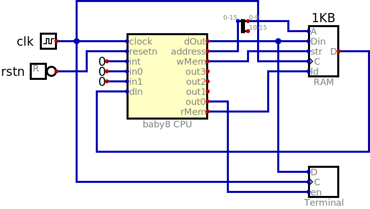
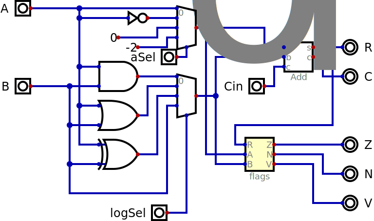
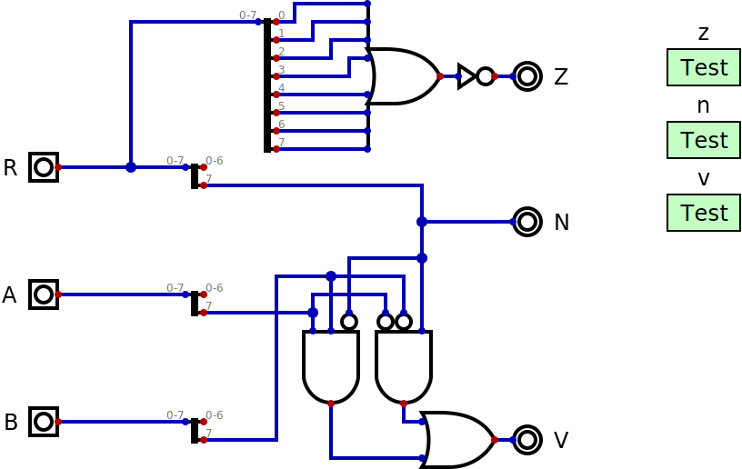
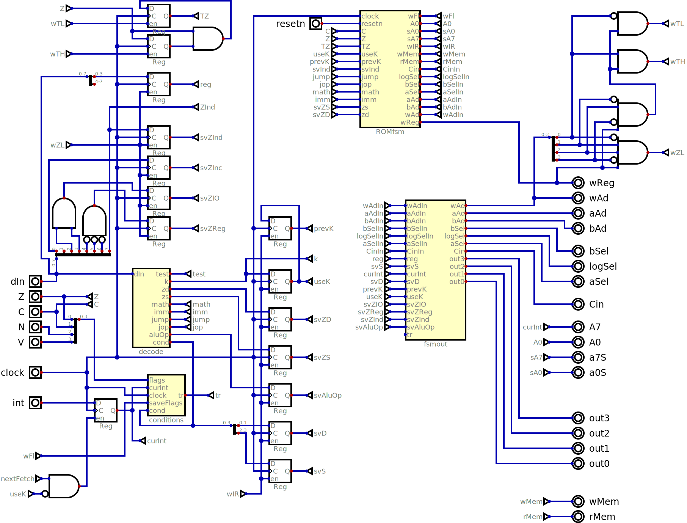
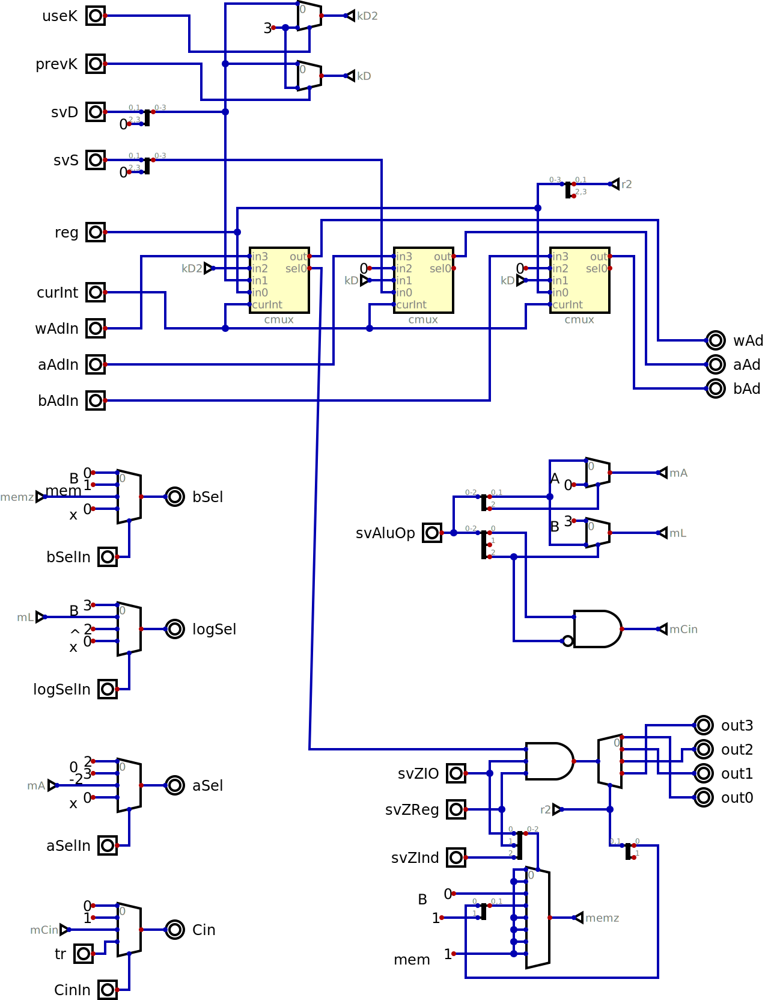
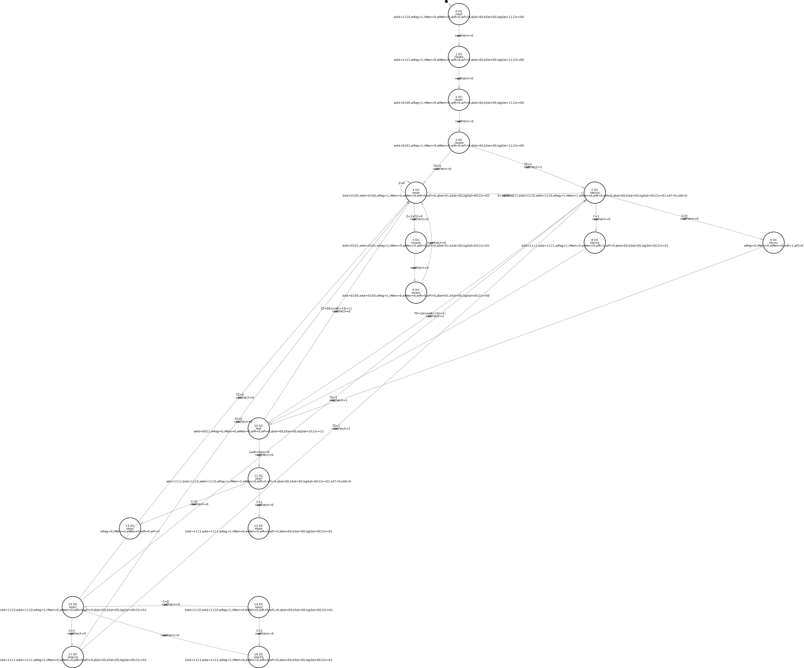

# Register Transfer Level

RTL is a design style where a single clock
signal goes to all registers in the circuit
and there are additional enable signals for
those registers so that a subset of them
update their values on a give cycles while
the others keep their previous value

Between the outputs of all the registers and
their inputs there is a combinational circuit.
The time between clock edges must be long enough
so the combinational circuit has settled to
a stable value before the hold time defined for
the registers.

## test_term.dig

This simple circuit connects the Baby 8 processor
with a small memory and a terminal output.

## baby8cpu.dig

The combination of the datapath and the control unit
forms the Central Processing Unit (CPU).

This requires and external memory pre-loaded with the
needed program and should be attached to one or more
peripheral devices.

## baby8_datapath.dig

This defines the logic needed to execute instructions,
including the registers and an ALU (arithmetic and
logic unit).

## baby_alu.dig

This combines two operands in the different ways needed
by the instructions.

## flags.dig

This calculates the zero, negative and overflow flags
based on the two operands and the result of the addition.

## baby8_control.dig

A hardwired finite state machine generates the signals needed
to use the datapath to execute instructions.

## decode.dig

This takes a byte and separates the signals indicating the
different parts of a Baby 8 instruciton. As a purely
combinational circuit, any of its outputs must be externally
saved if needed for later.

## test.dig

This saves flags to one of two registers depending on the
interrupt mode and allows testing the saved flags of the
current mode. The 16 different conditions, as seen in
PDP-11 and ARM processors are calculated and one is
selected.

## fsm2control..dig

The outputs of the Finite State Machine which is the heart
of the control unit don't match exactly what the datapath
expects, so this blocks converts one set of signals to
the other.

## cmux.dig

A helper circuit for fsm2control, this multiplexes four inputs
based on the content of the third input. It also detects access
to PH and PL registers and changes to iH and iL depending on
the current interrupt level.

## control_unit.fsm

A graphical version of the Finite State Machine described in
the spreadsheet.

## FSM based on ROM

Even with only a fraction of the FSM states implemented in the Digital
graphical editor it is easy to mix up the various arrows. So this
approach was dropped in favor of generating a ROM directly from the
spreadsheet.

1. A copy of the original sheet was created to allow changes.

1. Moved instructions to first 128 lines, copied non standard next field

1. Eliminated comment columns dIn and dOut

1. replaced don't care(x) with default values since they don't help ROMs like
they do with PLAs

1. convert text fields to numbers and start combining them

1. combined all but next field - only 4 bits left

1. cleared formulas in blank lines so they compile to 0 for a valid ROM

1. relative jumps to see what the common cases are

1. eliminate the two negative relative jumps
