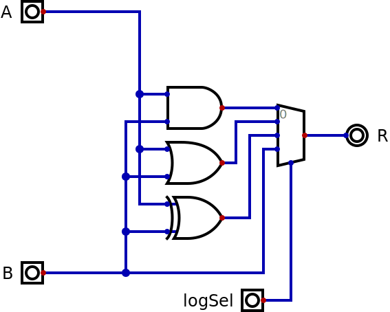
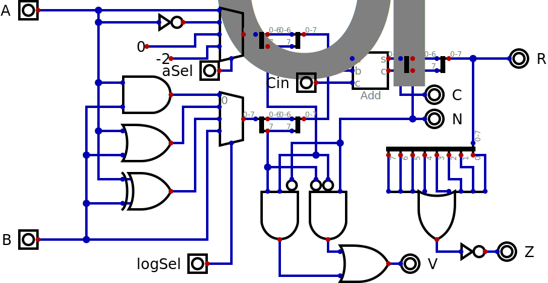
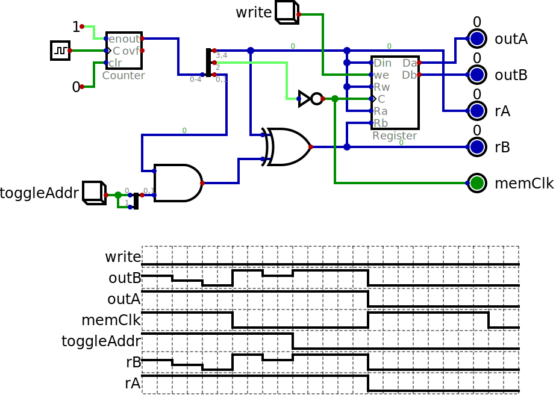
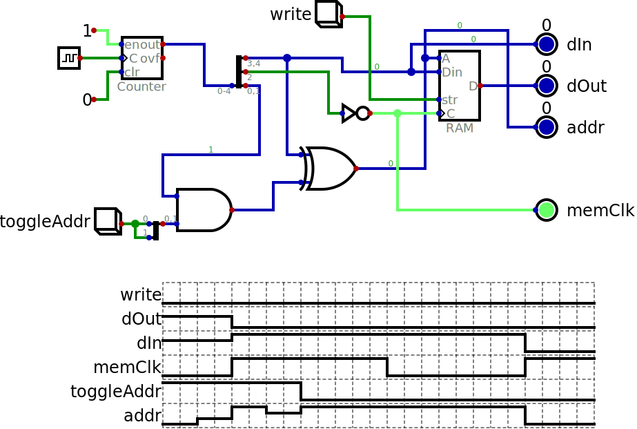

# simple experiments in RTL

A spreadsheet **softcoresizes.ods** (and its
generated PDF version) shows
the results of using the Yosys tool to
synthesize several processors and simple
blocks from Verilog to the following FPGAs:

- Lattice ICE40
- Gowin
- Intel Cyclone V
- AMD/Xilinx XC7 series

Note that some cores include the main memories
while most don't.

## RISC-V cores

### [darkriscv](https://github.com/darklife/darkriscv.git)
### [glacial](https://github.com/brouhaha/glacial.git)
### [serv](https://github.com/olofk/serv.git)
### [picorv32](https://github.com/cliffordwolf/picorv32.git)
### [riscv_simple](https://github.com/LAICO-UnB/riscv-simple.git)

- RV32I
- RV32IM

- Unicycle
- Multicycle
- Pipeline

The numbers for riscv_simple shouldn't be trusted as Yosys
seems to be completely optimizing one of the memories away.

## Other cores

### 6502 and ukp from [Nestang](https://github.com/nand2mario/nestang.git)
### [MCPU](https://github.com/cpldcpu/MCPU.git)
### j0 from Gameduino (multiplier and no multiplier)
### [MiniCPU](https://github.com/MorrisMA/MiniCPU-S.git)_SerPCU + MiniCPU_SerALU
### [ZPU avalanche](https://github.com/sergev/zpu-avalanche.git)
### Cray 1

## building blocks for Baby 8

### logic functions in ALU

### complete ALU

### complete datapath

## Digital blocks test

Note that the Digital versions use clock circuits and blocks
that can't be exported to Verilog, so to get the .v versions
these were replaced with input pins

### two port registers

### block ram

